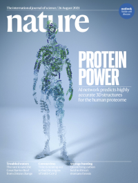

Alphafold2 讲解（1）

> 这是Alphafold2讲解的开篇文章，后续文章将对Alphafold2的每一个知识点深入的挖掘下去

> Alphafold2 Highly accuracy protein structure prediction with Alphafold

[TOC]

# 1. 导论

https://www.nature.com/articles/s41586-021-03819-2  2021/7/15

---

DeepMind声称Alphafold2解决了生物学中存在了50年的难题，《Highly accuracy protein structure prediction with Alphafold》，主要作者是John Jumper，详细的作者简绍可以参考这篇文章：https://zhuanlan.zhihu.com/p/315497173 （作为一个超大的工程项目，每一个作者都有自己的贡献，而不是想李沐说的很多打酱油的）

> https://deepmind.com/blog/article/alphafold-a-solution-to-a-50-year-old-grand-challenge-in-biology

同一天 Baker团队发布了Rosettafold，这项工作是由韩国人Baker实验室的博后Minkyung Baek 来完成 《*[Accurate prediction of protein structures and interactions using a 3-track network](https://science.sciencemag.org/content/early/2021/07/14/science.abj8754)*》

> https://www.ipd.uw.edu/2021/07/rosettafold-accurate-protein-structure-prediction-accessible-to-all/

---

> Alphafold2 登上的Nature封面 21年8月26号的封面 https://www.nature.com/nature/volumes/596/issues/7873

> Rosettafold登上了Science 21年8月20号的封面

# 2. Alphafold2 正文

## 2.1 正文概括

> 文章online版本和publish版本在文章布局方面是有稍微不同的

文章一共有10页，分为摘要、导论，模型简绍、结果分析、相关工作、讨论。附录中有一些方法的一些细节。更多的细节在60多页的补充材料中。

## 2.2 摘要

其逻辑是 

1. **研究背景**  蛋白质对生命至关重要，了解他们的结构可以促进对齐功能的理解

2. **传统的研究方法及其问题**  实验的方法至今才能解出10万的蛋白质结构，但是氨基酸序列有10亿的序列，但是传统的实验方法解出一个蛋白的结构可能需要花费数月甚至数年的时间。
3. **计算方法解决结构问题方法及其问题**  精确的计算方法需要去解决这个差距，并使得大规模结构生物学研究成为可能。仅仅根据氨基酸序列预测三维结构是“Protein folding problem"的结构预测部分，已经被研究了50多年。现有方法虽然有一些进步，但是现有的方法远没有达到原子精度，特别是没有同源模板的时候。
4. **Alphafold2** 论文首先提出了基于计算方法可以以原子精度来预测蛋白质结构甚至是在没有同源模板的情形。Alphafold2在CASP14上显示了非常高的准确性，Alphafold2将有关蛋白质结构的物理和生物知识，利用多序列比对，融入深度学习算法的设计中。

## 2.3 导论

从蛋白质序列预测三维结构的计算方法沿着两条互补的路径进行，这两条路径要不关注物理相互作用(physical interactions) 要不关注进化历史(evolutionary history)。

物理相互作用将对分子驱动力的理解融入到蛋白质物理学的热力学和动力学模拟中。尽管上理论上很吸引人，但是由于分子模拟的计算复杂性、蛋白质稳定性的上下文依赖性(上位性)、难以产生足够精确的蛋白质物理学模型。因此，物理相互作用对中等大小的蛋白质具有很高的挑战性。

现在，共进化提供了另一种选择，蛋白质结构的约束来源于蛋白质进化史的生物信息学分析，同源性解决了结构和两两进化相关性。这种方法受益于PDB数据中稳定增长的实验蛋白质结构，

**传统的方法是先预测蛋白质的Contact map间接预测蛋白质结构** 

之前的方法是先得到序列的contact map，然后再从contact map预测序列的结构，其理论基础是蛋白质的共进化信息。

---

**结果**

> x轴是参赛的队伍，y轴是Cα在95%置信区间内预测值和真实值之间的均方根误差，（Å埃。埃是长度单位。1 埃=1×10^ -10 米，10的负10次方米。）

Alphafold2的平均误差在1Å之间，一个C原子的直径是1.5~2Å，因此Alphafold2的误差是在原子精度内。

文章对PDB所有的蛋白质结构进行了预测，平均误差都是在1Å左右。

## 2.4 模型架构

模型架构可以分为四部分

- **模型输入部分**
- **Recycling部分**
- **Evoformer部分** （Encoder部分编码器部分）
- **Structure module部分以及最后输出** （Decoder部分解码器部分）【梯度在48层Evoformer和8层Structure module就会就算，Recycling部分不计算梯度】

---

### 1. 模型输入  MSA数据&Templates

模型输入使用了序列数据库和结构数据库

**序列数据库**

- UniRef90 (JackHMMER)
- BFD(HHnlits)
- Mgnify cluster(JackHMMER) 微生物组数据库

**结构数据库**

- PDB (用于训练)
- PDB70聚类 (HHsearch)

### 2. Evoformer部分【48层，不共享权重】

#### 1. MSA row-wise gated self-attention with pair bias

这部分可以划分为三个部分，row-wise 按行的；gated 带门的；pair bias 加上pair的偏移量

**row-wise 按行的**，整体的输入的维度为`s,r,c`  `s` 表示序列的数量 `r` 表示氨基酸的数量`c` 表示embedding的维度。取出每一行，维度为`r,c` ，得到Q,K,V。因此，`Q * K^T`得到残基和残基之间的相似性矩阵，softmax之后和V相乘就可以得到input的表示。

**gated 带门的**，经过一个linear层，经过sigmoid函数转化成0和1之间，得到的门控机制和输出做元素乘就完成了门控机制。这其实和LSTM中的输出门是一样的，学习一个门控控制哪部分元素应该输出，哪部分元素不应该输出。

**pair bias 加上pair的bias,** 加上pair的偏移量

==伪代码表示==

#### 2. MSA column-wise gated self-attention

构建不同列氨基酸之间的相关性，这可以学习到蛋白质的phylogeny信息。和wise是类似的操作。

#### 3. MSA transition [MLP部分]

2-layer MLP 

#### 4. Outer product mean 

氨基酸i可以由`s,c` 的矩阵来表示，对于氨基酸j来说也是`s,c`的矩阵来表示，我们需要将两个矩阵转化为一个向量。

`i` 和`j` 都经过linear转为到`s,c` 的维度，然后做外积(batch dot)，得到的维度为`s,c,c` 

`s,c,c` 在s上求mean，做flatten把矩阵拉成向量，经过linear得到c的维度加到pair representation上面。

#### 5.  Triangular self-attention【氨基酸对之间关系建模】

==Triangular gated self-attention around starting node==  wise

==Triangular gated self-attention around ending node== row

---

和wise self-attention上公式上一样，但是意义不一样，只有氨基酸对之间的关系。

==**这里为什么叫三角形的self-attenion呢？**==

**加上这个偏移量是想要模型学习三角不等式**

#### 6.  Triangular multiplicative update

Triangle updata using outgoing edges

---

### 3. Structure module 【8层，共享权重，类似于RNN】

**用绝对位置编码蛋白质的三维坐标对于旋转或者位移来说是不友好的，因此用相对位置编码蛋白质的三维坐标。** 

相对位置即下一个氨基酸相对于上一个氨基酸的位置变换，论文中使用了**欧几里得变换或者刚体变换**。

> https://zh.wikipedia.org/wiki/%E6%AC%A7%E5%87%A0%E9%87%8C%E5%BE%97%E7%BE%A4

---

==y = Rx + t (x是氨基酸的位置，表示为长度为3的向量；后面氨基酸的位置为y)==

R的维度为`3,3` ,t的维度为`3` 这样做的好处是如果对整体的蛋白质做旋转或者位移，不会对局部变换产生影响。

IPA module 将序列表示加入了位置信息，然后先预测主干的结构，然后加上一些枝干的结构

#### 1. IPA (Invariant point attention)

不动点的注意力

==**点不变的意思是？**==

---

#### 2. Backbone update

**预测主链结构【加入物理的信息】**

对第i个氨基酸去预测这个氨基酸对应的变换Ti，刚体变换由一个旋转矩阵(3*3的矩阵）和一个偏移量（3*1的向量）组成，我们对偏移量没有任何要求，但是对于旋转矩阵(3*3)要求正交矩阵，且norm是1，因此，旋转矩阵是9个元素，但是实际上三个元素就可以确定。

### 3. Recycling部分 【3次】

3次Recycling进行数据修正，但是不进行误差反传，只是在计算上贵了三倍，但是在内存上没有任何的瓶颈。

# 3. 训练细节

- 怎么在Transformer中加入位置信息
- Recycling怎么加上后面的信息

---

- 使用FAPE作为损失函数

- 自蒸馏 （nosiy student self-distillation)

  

  (先使用PDB的数据集进行模型训练，然后得到35万个中置信度高的结构预测结果和PDB的结构混合在一起继续进行训练)

- 加上BERT的mask任务有益于模型训练

- 模型在128张TPU v3上进行模型训练，随机初始化训练花费1周，微调花费4天的时间。

- 内存不够。内存基本上来源与误差反传的中间结果，因此我们可以把中间的计算结构丢掉，用时间来换取空间。

- 

# 4. 结果分析

**消融实验结果**

Evoformer 由48*4=192块，一般48个就稳定了，但是有一些难的蛋白质可以不断提升。

**T1024 结果**

 **T1064 结果**

> 参考：
>
> 1. 李沐《AlphaFold 2 论文精读【论文精读】》
> 2. AlphaFold的原理和展望 - 钟博子韬 | 钰沐菡 公益公开课